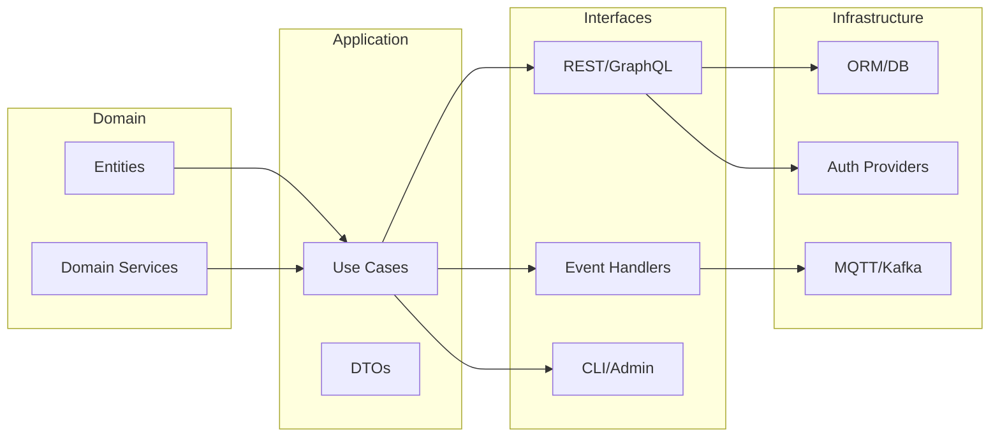

# Architecture Review & Rationalization Plan

This review captures current issues observed in the SmartFarm monorepo and proposes a pragmatic roadmap toward a stricter Clean/DDD/Hexagonal alignment across backend services, frontend apps, and infrastructure.

## Detected issues (high level)
- **Domain leakage & missing boundaries:** Domain dataclasses were co-located with service code without an explicit domain package, increasing coupling across services.
- **Inconsistent layering:** Service folders mix framework layers (Django/FastAPI app modules) with domain contracts in the same namespace, which breaks Clean Architecture boundaries.
- **Microservice overlap:** The `decision_engine_fastapi`, `data_ingestion`, and `monitoring` scopes overlap on ingestion/alert flows and lack clear message contracts.
- **Container concerns:** The current Compose stack exposes multiple services on the backend network without an ingress/proxy boundary and uses shared `.env` files without separation per environment.
- **Security/ops gaps:** No automated SAST/DAST/image scanning or secret scanning is configured; no rotation process for service-to-service credentials.

## Recommended target folder structure
The following tree aligns with DDD bounded contexts and Clean Architecture layers while minimizing churn for existing code.

```
backend/
  domain/
    entities/                 # shared aggregates/value objects
    services/                 # domain services (pure logic)
  application/
    use_cases/                # orchestration per bounded context
    dto/                      # request/response contracts
  interfaces/
    api_gateway/              # FastAPI façade
    rest/                     # Django/DRF adapters (user mgmt)
    messaging/                # MQTT/AMQP handlers
  infrastructure/
    persistence/              # ORM models/repositories
    brokers/                  # MQTT/Kafka clients
    security/                 # auth providers, token validators
  services/                   # existing microservice implementations (to be migrated gradually)
frontend/
  webapp/
  mobileapp/
edge/
  configs/
  labview_modules/
infrastructure/
  docker/
  k8s/
configs/
  global/
tests/
  unit/
  integration/
```

## New domain package layout
- **Moved** domain dataclasses into `backend/domain/entities/` to create a framework-agnostic domain layer.
- **Backwards compatibility:** `backend/domain/models.py` now re-exports the entities so existing imports continue to work during migration.

## Microservice boundaries & bounded contexts
- **Management (Django):** owns identity, RBAC, farm/barn/zones master data; expose REST and internal gRPC/HTTP ports only to trusted services.
- **Ingestion (FastAPI/MQTT):** responsible for sensor/device registration and raw payload intake; publish canonical events (`sensor.reading.ingested`) onto a message bus.
- **Decision/Alerts (FastAPI):** consumes canonical readings, evaluates rules, and emits alerts (`alert.raised`, `alert.resolved`).
- **Device Controller (FastAPI):** subscribes to commands/events for actuation; isolates edge-communication protocols.
- **AI Service (FastAPI/Python):** consumes curated events/telemetry; exposes async inference endpoints and batched model training jobs.
- **API Gateway (FastAPI):** single public entry; handles authN/Z, rate limiting, and request routing to internal services.

### Bounded context diagram
```mermaid
graph TD
  MGT[Management
  (Identity, RBAC,
  Farm/Barn/Zone)]
  ING[Ingestion
  (Device/Sensor registry,
  Telemetry intake)]
  DEC[Decision & Alerts
  (Rules engine,
  Alert lifecycle)]
  CTRL[Device Controller
  (Actuation,
  Edge protocols)]
  AI[AI Service
  (Inference,
  Model training)]
  API[API Gateway
  (Public API,
  AuthZ)]

  API --> MGT
  API --> ING
  API --> DEC
  API --> AI
  ING --> DEC
  DEC --> CTRL
  DEC --> API
  ING --> AI
  MGT --> DEC
```

## Clean/Hexagonal architecture view


## Docker & environment redesign
- Introduce a **frontend-facing reverse proxy** (e.g., Traefik or nginx) to terminate TLS and route to internal services; only expose the proxy.
- Use **service-specific network overlays**: keep MQTT on an `iot` network; restrict DB to `backend` network; expose gateway only on a `public` network.
- Prefer **multi-stage Dockerfiles** for Python services (builder stage + slim runtime) and pin lightweight bases (`python:3.11-slim`).
- Split environment files: `.env.development`, `.env.staging`, `.env.production`, and `.env.docker` templates; load them via Compose profiles.
- Store secrets in a vault (HashiCorp Vault/AWS Secrets Manager); inject at runtime via environment or sidecar, never in Git.

## Security & token plan
- Standardize on **JWT access tokens** issued by the Management service; short-lived access tokens + refresh tokens; include service-to-service audiences.
- Gateway validates tokens and forwards **JWT bearer** to downstream services; internal services verify audience/issuer using shared JWKS.
- Rotate secrets quarterly; use **OPA/Rego** or API Gateway middleware for fine-grained authorization.
- Enable **secret scanning**, SAST (Bandit/semgrep), and container image scanning (Trivy/Grype) in CI.

## CI/CD pipeline sketch
- GitHub Actions workflows:
  - `lint-test.yml`: run `ruff`/`flake8`, `pytest`, `mypy` (Python) and `eslint`/`next lint` (frontend).
  - `security.yml`: run Bandit/semgrep, Trivy on images, and `gitleaks` for secret scanning.
  - `build-and-push.yml`: build multi-arch Docker images, push to registry, sign with cosign, and publish SBOMs.
  - `deploy.yml`: rollout to staging/prod via Helm/ArgoCD with progressive delivery gates.

## Migration guidance (git-ready steps)
1. Move shared entities into `backend/domain/entities/` (done in this PR) and re-export from `backend/domain/models.py` for compatibility.
2. Carve out application use cases per bounded context under `backend/application/use_cases/` and keep frameworks in `backend/interfaces/`.
3. Introduce DTOs for API contracts to decouple request payloads from domain objects.
4. Gradually refactor each service to depend on domain/application layers via dependency injection rather than importing frameworks directly.
5. Consolidate Compose into environment-specific stacks with a single ingress container and per-service networks.
